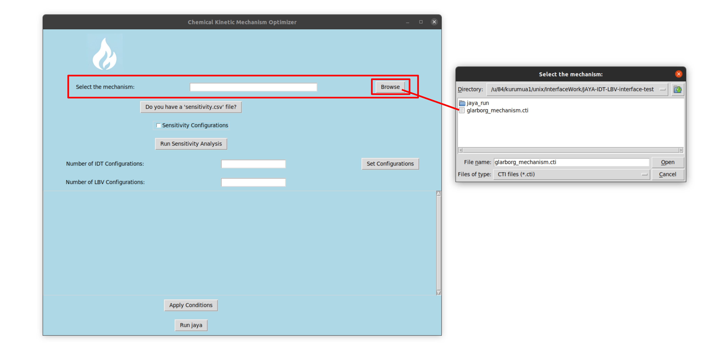
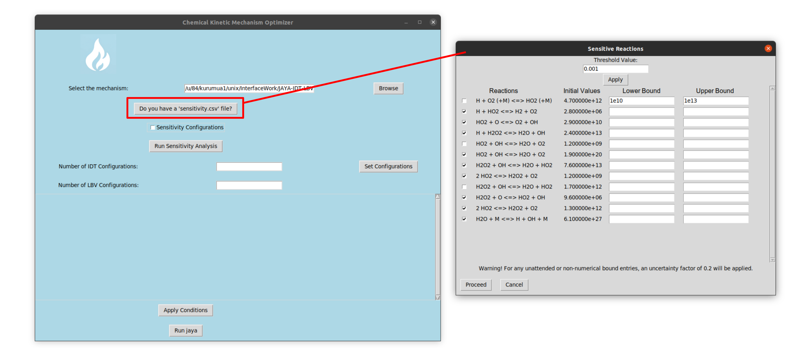
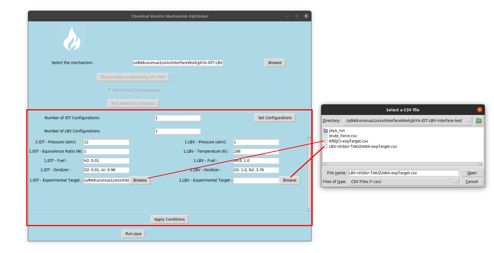

# JAYA Chemical Mechanism Optimizer

## Requirements
- Python 3.8.10
- Cantera 3.0

## Instructions for Use
- Start the application by typing "python3 cantera-JAYA-GUI-test.py" in the terminal provided with the tutorial.

- Ensure your .csv files are in the same format as those shown in the tutorial.
  
### Step 1: Mechanism Input
- Start by inputting your chemical mechanism in .cti format. The setup will validate your .cti syntax, so check that your file is in good order.

### Step 2: Sensitivity Analysis and the Pre-Exponential Uncertainty Range

- Next, follow the example from the tutorial and input your sensitivity analysis file.
- You can screen additional reactions by reducing the threshold value.
- If there's any reaction you wish to remove, simply de-select its tick box.
- You'll also need to specify the lower and upper range for the pre-exponential coefficient.

### Step 3: Simulation Configurations

- From here, you have to input numbers for every configuration needed.
- Determine and set the experimental conditions you're targeting.
- For every target, include the corresponding experimental data in a .csv file, using the format shown in the tutorial.
- Once you've defined all the configurations, press "Apply Conditions". The GUI will then generate the necessary files.

- Initiate the optimization process by clicking "Run JAYA".
- With each iteration, a "run." folder will be created.
- Keep track of your objective values by running the "python3 readObjectives.py" command in your terminal.
